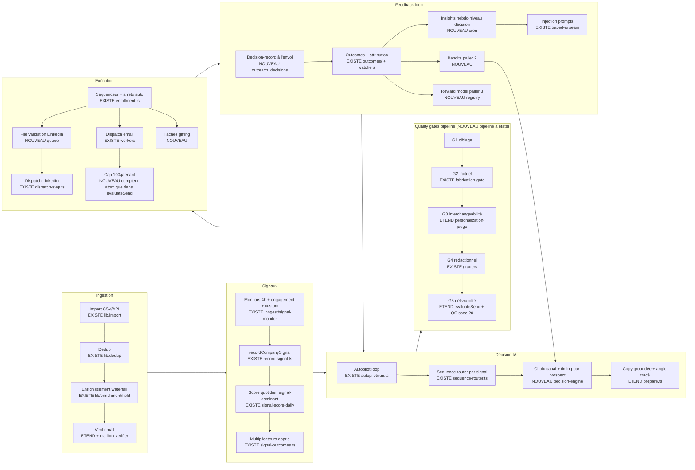

# Design — Outreach multi-canal autopilote (Phase 2)

Date : 2026-07-02. Dépend de : `requirements.md` (Phase 1) + `ux.md` (Phase 1bis).
Ancrage brownfield : chaque composant est marqué **[EXISTE]** (réutilisé tel quel), **[ÉTEND]** (modifié) ou **[NOUVEAU]**.
Réfs code = `app/apps/web/src/` sur origin/main.

Principe directeur : l'audit Phase 0 a montré que ~70 % de l'ossature existe — ce design MAXIMISE le câblage de
l'existant et n'introduit de nouveau composant que là où le gap est réel (decision-record, file LinkedIn, cap tenant,
pipeline de gates à états, gifting).

---

## 1. Architecture globale



## 2. Modèle de données

**Tables existantes réutilisées telles quelles** : companies (+properties.signals[]), contacts, sequences/steps/enrollments,
outbound_emails, activities, action_outcomes (+watchers), signal_outcomes, suppression (spec 22), agent_traces,
tenant_settings, meetings/invites, sequence_drafts (state machine).

**Nouvelles tables (7) — chacune sert une exigence identifiée :**

| Table | Colonnes clés | Sert |
|---|---|---|
| `tenant_send_counters` | tenant_id, day (date, fuseau tenant), sent_count, PK(tenant_id, day) | INV-1/M5-R1 — compteur atomique du cap |
| `outreach_decisions` | id, tenant_id, contact_id, company_id, enrollment_id?, step_index?, channel, persona jsonb {seniority, function, company_size, sector, maturity}, signal jsonb {type, detected_at, source, freshness_days}, angle, alternatives jsonb, message_features jsonb {length_words, cta_type, tone}, scheduled_at, prompt_version, model, gate_scores jsonb, outcome_id? (FK action_outcomes), created_at | M12-R1 — l'unité d'apprentissage |
| `gate_decisions` | id, tenant_id, subject_type (draft/manual/step/**enrollment/send** — étendu à l'implémentation T6 : G1 a un contact comme sujet, G5 au transport un envoi), subject_id, gate (1..5), rubric_version, score, verdict (pass/blocked/reworked), reasons jsonb, created_at ; colonnes TEXT (table de log — pas d'ALTER TYPE futur) | M13-R6/R7 — logs visibles + taux de blocage (pass ET blocked écrits pour que le taux soit calculable) |
| `linkedin_action_queue` | id, tenant_id, seat_id, contact_id, enrollment_id?, action_type (visit/invite/message), payload jsonb (message, signal_ref), state (pending/approved/dispatched/failed/expired/skipped), expires_at (= min(TTL signal, +7 j)), decided_by?, decided_at | M6-R1 — la file de validation |
| `gifting_tasks` | id, tenant_id, company_id, contact_id, trigger_signal jsonb, suggestion jsonb {gift, budget_eur, message}, state (suggested/approved/done/refused/blocked_budget/expired), refusal_reason?, created_at, resolved_at | M7 |
| `reply_review_queue` | id, tenant_id, email_id, classification jsonb {sentiment, intent, confidence}, corrected jsonb?, state (pending/corrected/confirmed), reviewed_at | M8-R2/M11-R3 |
| `model_registry` | id, kind (reward/scoring), version, artifact_ref, trained_on {from, to, n_decisions}, metrics jsonb {auc, p_at_k}, status (candidate/canary/active/rolled_back), promoted_at | M12-R4 |

**Extensions de tables existantes** : `tenant_settings.linkedin_auto_mode` (par seat, avec `activated_at` + `disclosure_ack` — M6-R2) ;
enum outcome + `meeting_held` (déjà posé côté POSITIVITY, PR #609). Correction post-revue : il n'existe PAS de table `meetings`
(les meetings sont fetchés live des calendriers + persistés en activities) et le tracking d'attendance held/no_show EXISTE déjà
(PR #270, `resolveAttendance`) — aucune migration attendance ; le travail réel est le producteur d'outcomes meeting_booked/meeting_held (T12).
Migrations via le runner custom `db:migrate:apply` (journal drizzle arrêté à idx 12 — règle CLAUDE.md).

## 3. Cap 100/j/tenant — garanti techniquement (pas configuré)

- **Constante compilée** : `export const OUTREACH_DAILY_TENANT_CAP = 100 as const;` dans `lib/guardrails/sending-gate.ts` —
  pas d'env, pas de colonne DB, pas d'`OverridableKey`. La modifier = un commit revu.
- **Compteur atomique** : `UPDATE tenant_send_counters SET sent_count = sent_count + 1 WHERE tenant_id = $1 AND day = $2 AND sent_count < 100 RETURNING sent_count` (précédé d'un `INSERT ... ON CONFLICT DO NOTHING`). Zéro ligne retournée = cap atteint = refus. Aucune race possible entre workers concurrents (l'atomicité est dans l'UPDATE conditionnel, pas dans une lecture-puis-écriture).
- **Placement** : PREMIER check de volume dans `evaluateSend` (sending-gate.ts:214), donc automatiquement présent sur les 5 chokepoints, tous modes y compris `external-connected` (ferme sending-identity.ts:115-124). Précédent exact : le rate limit tenant #565.
- **Classes d'envoi** (tel qu'implémenté, PR #615) : `sendClass: 'outreach' | 'reply'`. Le cap compte `outreach` uniquement ; répondre à un prospect qui a écrit n'est pas prospecter. La classe est dérivée CÔTÉ SERVEUR, jamais d'un body de requête : C1/C2/C3 depuis la row `outbound_emails` du worker (`inReplyTo` → reply) ; C4/C5 (interactifs) auto-classifiés in-gate. Toute classification `reply` — déclarée ou dérivée — est RE-VÉRIFIÉE dans le gate contre un email ENTRANT réel du destinataire (`hasInboundEmailFrom`, from-only, plus strict qu'`isColdRecipient`) ; claim invérifiable ou lookup en erreur = `outreach` (fail-toward-counting). Défaut absent = `outreach`.
- **Périmètre de l'invariant** : le cap gouverne tout envoi INITIÉ par Elevay (les 5 chokepoints). Tout câblage futur de `sendViaInstantly` DOIT passer par `evaluateSend` ; le mode « campagne pilotée côté provider » (scheduler Instantly exécutant seul) est INTERDIT — il contournerait le cap par construction.
- **Le décrément n'existe pas** : un envoi refusé en aval (provider down) ne rend PAS le jeton — le compteur mesure les tentatives autorisées, pas les délivrés ; c'est conservateur, dans le bon sens.
- **`day`** calculé dans le fuseau du tenant (existant dans tenant_settings) ; un changement de fuseau ne peut que RACCOURCIR une journée (jamais deux resets — on garde le max(day) déjà ouvert).
- **Comportement au cap** : chemins cron → requeue au lendemain (pattern #565 existant) ; chemins interactifs → erreur explicite « cap quotidien atteint » avec l'état du compteur (UX 4).
- **Sous-plafonds conservés** : 20/j primary, 50/j mailbox et la rampe warmup restent EN DESSOUS du cap ; le cap est le plafond dur au-dessus de tout. Le rate limit tenant 60/min+600/h n'est PAS un sous-plafond de volume (600/h ≈ 14 400/j théoriques) : c'est un lissage de débit anti-runaway (safety net), orthogonal au cap.

## 4. Moteur de décision IA

- **Sélection de séquence** [EXISTE] : sequence-router (ICP-scoped → trigger-signal → fallback). Inchangé.
- **Choix canal + timing par prospect** [NOUVEAU `lib/autopilot/decision-engine.ts`] : à l'enrollment, une décision structurée par prospect. Entrées : fiche prospect (persona features), signaux frais, coordonnées disponibles (email vérifié ? seat LinkedIn connecté ?), historique d'interactions, contexte appris (multiplicateurs, insights, bras de bandit actifs). Sortie JSON stricte :
```json
{
  "channel_first": "email|linkedin",
  "send_window": {"day_offset": 0, "hour_local": 9, "timezone": "prospect"},
  "angle": {"chosen": "scaling-gtm", "alternatives": ["hiring-ramp", "cost"], "why": "…"},
  "sequence_id": "…",
  "confidence": 0.82,
  "citations": [{"claim": "…", "source": "…", "date": "…"}]
}
```
  Implémentation : AI SDK v6 `generateObject` via `traced-ai` (le seam existant injecte prompts/few-shots/playbook appris — traced-ai.ts:90-308). Le timing décidé est CONTRAINT par les fenêtres tenant (clamp, jamais bypass). Modèle : Sonnet (décision par prospect ~1 appel/enrollment, pas par step).
- **Prompt système versionné** [EXISTE — registre de prompts + canary] : le prompt de décision entre dans le même pipeline canary/promote/rollback (lib/prompts/canary-ramp.ts). Squelette v1 (versionné comme du code) :
```text
Tu décides le premier touchpoint d'outreach pour UN prospect. Tu ne rédiges pas le message.
RÈGLES DURES :
1. Tu n'affirmes AUCUN fait qui ne soit pas dans le BRIEF ci-dessous (faits cités, datés, sourcés). Pas de fait = pas d'angle qui s'y appuie.
2. Tu choisis parmi les ANGLES CANDIDATS fournis, jamais un angle inventé. Tu listes ceux que tu écartes et pourquoi.
3. channel_first=email exige email_verifie=true ; channel_first=linkedin exige seat_connecte=true. Aucun des deux = tu retournes decision=skip avec la raison.
4. Le send_window respecte les fenêtres tenant fournies ; tu proposes DANS ces bornes.
5. CONTEXTE APPRIS (insights + bras de bandit) = préférences à pondérer, jamais des ordres : si un insight contredit la règle 1-4, les règles gagnent.
SORTIE : uniquement le JSON du schéma fourni (channel_first, send_window, angle{chosen, alternatives, why}, sequence_id, confidence, citations[]).
```
- **Anti-hallucination** : le decision-engine ne produit AUCUN fait nouveau — il choisit parmi les faits cités du brief (buildIntelligenceBrief existant, cache 14 j) ; toute claim sans citation est rejetée par G2 en aval.
- **Opens** : jamais dans les entrées du moteur (INV-7). Purge des deux sites restants : `campaign-decision-engine.ts` (retirer `email_opened` de triggerEvent) et `up-next` (critère → clicks/replies).

## 5. Pipeline quality gates — états explicites, coût maîtrisé

**Étages** (le pipeline est ASYNCHRONE, hors chemin d'envoi ; seul l'étage T-0 est synchrone) :

| Gate | Quand | Implémentation | Modèle/coût |
|---|---|---|---|
| G1 ciblage | à l'ENROLLMENT (tous les chemins : autopilot, chat, manuel) | [ÉTEND] `enrollment-eligibility.ts` : + règle bloquante « ICP ≥ seuil ET ≥1 signal frais » ; raison persistée dans gate_decisions | déterministe, 0 LLM |
| G2 factuel | à la GÉNÉRATION + re-vérification T-0 | [EXISTE] fabrication-gate 2 couches + citation-gate T-0 (citations.ts) ; [ÉTEND] : câblé sur TOUS les chemins de génération + envois manuels (véracité des claims du corps saisi) | 1 appel Haiku/message + HEAD checks |
| G3 interchangeabilité | à la GÉNÉRATION | [ÉTEND] personalization-judge : rubrique explicite « ce message pourrait-il partir tel quel vers un autre prospect ? » (test de substitution : remplacer société/nom → le message reste-t-il vrai ?) | 1 appel Haiku/message |
| G4 rédactionnel | à la GÉNÉRATION | [EXISTE] email-quality-grader + sequence-quality ; [FAIT T6] : seuil = `passThresholdFor` EXISTANT (0.7, 0.8 tier-1 BASHO — correction vs « 0.75 configurable » : le brownfield possède déjà ce seuil central, pas de nouveau bouton), régénération max N=2 (re-roll — personalizeStepEmail n'a pas de canal feedback) puis `set_aside` avec explication dans reviewReason ; crash grader = fail-open vers la revue humaine, verdict loggé | déterministe au router (gradeGeneratedStep) |
| G5 délivrabilité | T-0 dans evaluateSend | [ÉTEND] evaluateSend : + `runQc`/`sendEligible` du QC gate spec-20 (spam-words, ratio liens pré-footer, brand) — ENFIN câblé — + check désinscription (À ÉCRIRE, absent de runQc) + cap M5-R1 ; suppression et thresholds existent dans le gate ; ATTENTION : warmup et DNS-auth vivent côté WORKERS/capacity-source, pas dans le gate partagé — assumé cron-only en v1 (les envois interactifs ne les traversent pas) | déterministe, 0 LLM |

- **États** [FAIT T6] : `sequence_drafts` porte déjà une state machine — étendue telle qu'implémentée : `gates_running → pending_approval (pass) | blocked → reworking → gates_running (1 re-roll) ; blocked 2× → set_aside (terminal, jamais envoyé)`. Les états existants (pending_approval/approved/rejected/expired/sent) sont INCHANGÉS ; `expire` balaie aussi les états de gate coincés. Chaque verdict écrit `gate_decisions` (state-machine.ts = seule autorité de transition, y compris dans le runner).
- **Envois manuels** (INV-10/M13-R8) : le composer appelle un endpoint `POST /api/send/pregate` (G2 rapide + G5 déterministe, ~1-2 s) avant l'envoi ; refus = explication inline. Pas de G3/G4 sur le manuel (l'humain assume son style).
- **Rubriques versionnées** : chaque gate LLM référence `rubric_version` (fichier TS versionné, comme du code) ; le golden set (lib/evals/golden-cases.ts [EXISTE]) s'enrichit de cas annotés excellent/moyen/mauvais pour calibrer les seuils ; toute modification de rubrique passe la suite d'evals (INV-8).
- **Coût/latence** : 3 appels Haiku par message généré (~1-3 s chacun, asynchrone) ≈ 0,01-0,03 $ par message, soit ≤ 3 $/jour au cap — négligeable vs la valeur. À T-0 : les checks NOUVEAUX (runQc, cap) sont déterministes (< 50 ms ajoutés) ; la re-vérification T-0 des citations (existante) reste I/O-bound (HEAD checks) avec timeout fail-closed. Fail-closed : gate LLM en erreur = blocked, jamais pass par défaut.
- **Métrique de pilotage** [NOUVEAU] : vue agrégée gate_decisions → taux de blocage par gate (UI reporting, M13-R7).

## 6. File d'attente & throttling

- **Files** [EXISTE] : Inngest (workers d'envoi, crons) + tables de scheduling des steps. Le cap M5-R1 s'insère dans evaluateSend (§3) ; en refus `cap_reached` les workers requeuent au lendemain (statut existant du pattern #565, pas d'échec définitif).
- **File LinkedIn** [NOUVEAU] : quand un step LinkedIn est dû, le dispatcher écrit dans `linkedin_action_queue` (state pending) AU LIEU d'exécuter — sauf si `linkedin_auto_mode` actif pour le seat (alors chemin direct existant). Approbation → `dispatchLinkedInAction` existant (tous ses garde-fous intacts : santé, suppression, anti-collision, quotas seat, idempotence). Sweep horaire : `pending` dont `expires_at` dépassé → `expired` (trace, sortie d'UI active).
- **Priorisation intra-cap** : si plus de candidats que de budget jour, l'ordre est le priority_score (signal-dominant existant) — jamais du remplissage (INV-11 : en dessous du seuil G1, un candidat n'entre pas, même si le cap n'est pas atteint).

## 7. Intégrations

| Domaine | Choix | État |
|---|---|---|
| Email sortant | Ports existants (Instantly external-connected, SMTP, Gmail/MS OAuth) | [EXISTE] — le cap s'applique désormais à tous |
| Vérification email mailbox | `VerifyProvider` — l'interface existante de verify-email.ts, « slotted in » (mx-verify-provider.ts:6 ; VerifySignal porte déjà mailboxOk/catchAll/spamTrap) ; provider v1 : **NeverBounce ou ZeroBounce** (choix à l'implémentation selon pricing au volume réel ; l'abstraction rend le choix réversible) ; politique M1-R4 : invalid=bloqué, risky/catch-all=bloqué par défaut | [ÉTEND] |
| Enrichissement | Waterfall existant (Apollo + registres) | [EXISTE] |
| Calendrier | Scheduler existant + Google/MS OAuth ; `meetings.attendance` rempli par heuristique calendrier (event non annulé + participant accepté) sinon question UI (UX 3.6) | [ÉTEND] |
| Gifting | AUCUNE intégration v1 (décision founder) — `gifting_tasks` manuel ; l'interface (suggestion/état/outcome) est conçue pour brancher Reachdesk/Alyce derrière plus tard | [NOUVEAU] |
| LinkedIn | Unipile existant (seats, quotas, rampe) — inchangé, coiffé par la file | [EXISTE] |

## 8. Stack & jobs planifiés

Stack inchangée (justification : tout le système vit déjà dans app/apps/web — Next 15 + Drizzle/Postgres + Inngest + AI SDK v6/traced-ai ; introduire un service séparé serait un océan sans bénéfice au volume cible de 100/j/tenant).

Jobs : existants (signal-monitor 4 h, signal-score-daily 6:00, deliverability-monitor, outcome-detector, data-retention 3 h, tam-refresh) + **nouveaux** : `decision-insights-weekly` (lundi 6:00 — palier 1), `linkedin-queue-sweep` (horaire — expiration), `meeting-attendance-check` (quotidien — M8-R4), `bandit-update` (event-driven sur outcome/resolved — palier 2), `reward-train-nightly` (palier 3, gated volume).

## 9. Architecture de la boucle d'apprentissage

- **Event tracking** [EXISTE+ÉTEND] : outcomes/watchers existants ; l'écriture `outreach_decisions` au moment de l'envoi (transport, après evaluateSend OK) et à chaque action LinkedIn dispatched. Le decision-record est JOINT à l'outcome par le watcher existant (action_outcomes) — pas de second système d'attribution.
- **Feature store** : pas de système dédié (océan) — les features sont DÉNORMALISÉES dans outreach_decisions au moment de la décision (snapshot jsonb) : c'est ce qui rend le dataset rejouable même si le prospect change ensuite.
- **Labellisation** [EXISTE] : la hiérarchie POSITIVITY (corrigée PR #609) + reply_review_queue (corrections humaines = labels premium, M8-R2).
- **Palier 1 — insights** [NOUVEAU cron] : hebdo, LLM (Sonnet) sur DEUX sources — (a) agrégats de outreach_decisions × outcomes (jamais sur les corps de message bruts), (b) les RAISONS DE REJET de sequence_drafts (un draft rejeté ne produit jamais de decision-record ; c'est la seule trace de l'anti-pattern « rejeté N fois sur le même motif », ux 3.3/M12-R2) → `insights` + `anti_patterns` en langage clair AVEC les chiffres (n, lift) → stockés dans le store d'artefacts appris existant → injectés via `applyLearnedContext` (traced-ai.ts:121) [ÉTEND : le seam est gated sur DRAFTING_AGENT_IDS ; ajout de l'agent decision-engine au set + getter du bloc insights] → affichés cockpit/reporting (UX 3.2/3.8). Seuils cold-start (source unique, citée par toutes les copys UI) : un insight s'affiche dès n ≥ 10 décisions sur SON pattern ; l'état cold-start affiche le compte total de décisions trackées.
- **Hiérarchie d'outcomes — décision v1 (02/07)** : POSITIVITY n'est PAS re-scalée (le code garde replied_negative -0,3 < no_response 0,0) — les consommateurs `positivity > 0.3` (learned-trust.ts:126-131, stats.ts) donnent une sémantique au SIGNE qu'un re-scale casserait. La hiérarchie ORDINALE cible de M11-R1 (négatif fort < aucune réponse < réponse négative < ... < RDV honoré) est encodée à l'AGRÉGATION du decision-record (palier 1 : rang ordinal dérivé de outcome_type au moment de l'analyse), pas dans POSITIVITY. Réévaluer au palier 2 si les patterns « réponse négative > silence » s'avèrent porteurs de signal.
- **Attribution — périmètre v1 assumé** : last-touch via le watcher existant uniquement. La fenêtre multi-touch de M11-R4 (créditer les touchpoints de la fenêtre joints au même outcome) est HORS-SCOPE v1 — réévaluée au palier 2 quand le volume de decision-records la rend calculable (cf. tasks.md hors-périmètre).
- **Palier 2 — bandits** [NOUVEAU `lib/learning/bandits.ts`] : déclenchement ≥ 300 décisions tenant. Thompson sampling Beta(α,β) par bras, dimensions : angle × persona-segment, fenêtre d'envoi (matin/midi/fin de journée), ordre des touchpoints (2 variantes de séquence max). Le bandit PROPOSE au decision-engine (un input parmi d'autres) ; il ne force jamais un choix qui violerait la pertinence (G1-G3 restent bloquants). Reward = positivity ≥ 0.4 (réponse neutre+). Update event-driven sur outcome/resolved.
- **Palier 3 — reward model** [NOUVEAU] : déclenchement ≥ 2 000 décisions labellisées dont ≥ 100 positives (tenant ou pool cross-tenant anonymisé — la distillation PII-strippée existe, lib/distillation). Modèle v1 : régression logistique/GBDT sur les features du decision-record (PAS un LLM — auditable, entraînable sur un cron). Éval offline : split temporel train/test, AUC + precision@20 vs baseline (priority_score seul) ; promotion si AUC > baseline + 0,05 ET canary 2 semaines sans dégradation bounce/spam ; registre + rollback = `model_registry.status`. Usage : re-rank les candidats de l'autopilot AVANT le cap (filtre, jamais générateur).
- **Garde-fous** [M12-R5] : un insight/bras/modèle qui augmente le volume vers un segment à bounce élevé est invalidé automatiquement (croisement avec deliverability thresholds) ; monitoring de dérive = distribution des décisions vs semaine précédente (alerte si KL-divergence anormale — heuristique simple, pas de MLOps lourd).

## 10. Infrastructure AI-native

[EXISTE en quasi-totalité — c'est la force du brownfield] : prompts versionnés + canary/promote/rollback (canary-ramp.ts), suite d'evals (lib/evals/* : fabrication, personalization-judge, quality-graders, golden-cases, personalization-backtest), traçage complet des appels (traced-ai + agent_traces), eval gate CI (`pnpm eval:run`). [ÉTEND] : les rubriques des gates G2-G4 rejoignent la suite d'evals ; le prompt du decision-engine entre dans le canary ; chaque `outreach_decisions.prompt_version` rend l'audit décision→prompt possible.

## 11. Design system — mapping tokens → composants (wireframes → build)

| Élément UX | Composant | Tokens |
|---|---|---|
| Header d'écran | PageHeader existant (components/ui/page-header.tsx) | 44px, contrôles h-7 (invariant) |
| Barre d'état cockpit | [NOUVEAU] StatBar sous header | bg-card, border-default, jauge success (le cap plein = VERT si qualité atteinte, INV-11) |
| Cartes « prêt pour toi » | Card existante | bg-card, border 1px, rounded-lg, shadow-card |
| Badges signal/gate | Badge existant | accent-soft/info pour signal ; success/warn/error pour gates |
| Timeline séquence | [NOUVEAU] SequenceTimeline (pattern Monaco 011) | rail border-hover, dots accent |
| File LinkedIn | [NOUVEAU] page + cartes clavier-first | kbd style mono 11px, focus ring border-focus |
| Récit d'attribution | [NOUVEAU] AttributionStory | success-soft pour le RDV |
| Reporting outcomes-first | étend reports | ordre imposé RDV honorés → envois (grisé) ; open-rate UNIQUEMENT écran délivrabilité |

## 12. Traçabilité UX → technique

| Parcours (ux.md) | Composants d'architecture | Données temps réel requises |
|---|---|---|
| 3.1 Onboarding <15 min | import + icp/nl + dns auth + autopilot 1er lot | statut DNS (lookup live), taille TAM matché, candidats à signal frais |
| 3.2 Cockpit | drafts + linkedin_action_queue + gifting_tasks + gate_decisions + insights + tenant_send_counters + deliverability guard + meetings | compteur cap (lecture directe) + items différés au cap (rows requeued `daily_cap_reached`, T2), files (count + top items), derniers blocks de gates, insights n≥10, santé délivrabilité (thresholds/guard existants), RDV pris/honorés de la semaine |
| 3.3 Revue séquences | sequence_drafts state machine + gate_scores + citations | scores G2-G4 par draft, source par claim |
| 3.4 File LinkedIn | linkedin_action_queue + seat quotas (limits.ts) + auto_mode flag | quotas seat consommés, expirations |
| 3.5 Réponses | inbox existante + reply_review_queue | classifications < seuil de confiance |
| 3.6 RDV payoff | meetings.attendance + outreach_decisions→outcome (attribution) | la chaîne signal→décision→message→réponse→RDV du prospect |
| 3.7 Gifting | gifting_tasks | budget consommé/mois |
| 3.8 Reporting | agrégats outcomes + gate_decisions + outreach_decisions | hiérarchie M11-R1, taux de blocage par gate, patterns n/lift |

## 13. Risques & mitigations

| Risque | Mitigation |
|---|---|
| Délivrabilité (réputation brûlée) | Cap dur 100/j + sous-plafonds + rampe + thresholds auto-pause [EXISTE] + vérifieur mailbox [NOUVEAU] + G5 systématique ; placement tests en P2 |
| Ban LinkedIn | Défaut = file de validation (l'humain exécute) ; auto = opt-in journalisé + disclosure + quotas FIXES (limits.ts convertis en constantes non overridables) + fail-closed sur santé du seat [EXISTE] |
| Hallucination IA | G2 2 couches + citation-gate T-0 [EXISTE, unique sur le marché audité] + never-invent floor + G3 ; zéro claim sans source |
| RGPD | Suppression cross-canal [EXISTE] + purge [EXISTE] + lawful-basis gate à ALLUMER après backfill + registre des traitements [NOUVEAU, P3] + gifting sans adresse perso scrapée |
| Coût/latence gates | LLM hors chemin d'envoi (async), Haiku, ~0,03 $/message max, T-0 déterministe ; budget mesurable via agent_traces.estimated_cost [EXISTE] |
| Cold-start apprentissage | Priors informés [EXISTE] + seuils d'affichage honnêtes (UX) + paliers gated sur volume — jamais de fausse confiance |
| Dérive d'apprentissage | Croisement automatique insights×délivrabilité + monitoring de distribution (§9 garde-fous) |
| Régression sur l'existant | Chaque câblage dans evaluateSend/enrollment est fail-closed et testé ; les chemins non-outreach (reply, transactionnel) sont exemptés du cap EXPLICITEMENT (sendClass) pour ne pas casser l'inbox |
